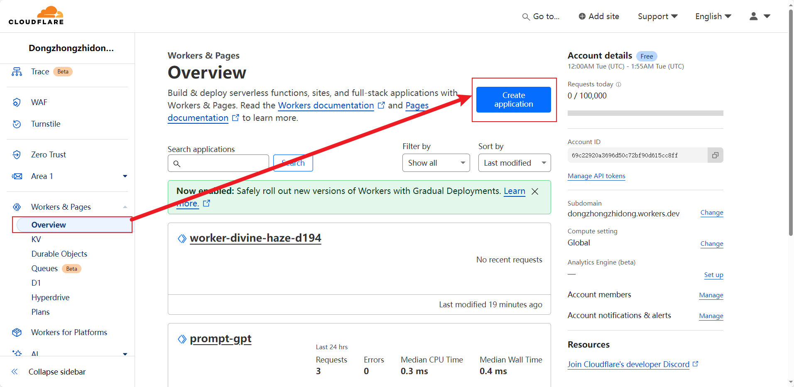
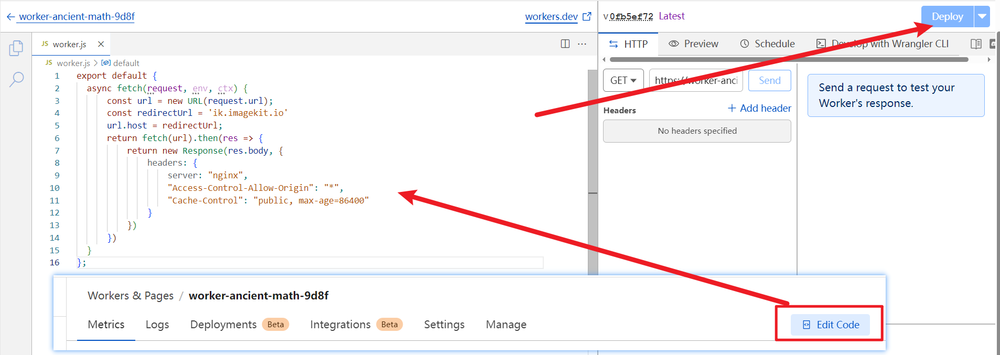

# 转接 ImageKit 服务器

由于某些原因，我们可能需要转接一下 ImageKit 服务提供商的 CDN，使得我们的网站得到更快，更好的加载速度。这个时候，我们需要用免费的函数计算服务，将 Imagekit 提供的数据转换到另一个域名。

> 如果你是转接给 CDN 使用，那么完全没有问题；CDN 的缓存仅仅会少量访问你的中继服务器。但是如果是直接提供给你的网站使用，那么最好斟酌一下。

## 核心逻辑

1. 利用免费的 Worker 服务，转换原始网站 URL 为另外一个 URL。
2. 达成的效果是只需要改变 URL 的域名就可以访问的到相同的数据。
3. Worker 是一种边缘部署的 JS 运行时的服务器。一般服务商会直接提供一个域名给你部署这个服务器。


## 使用 Cloudflare 转接（推荐）

虽然 Cloudflare 在国内的速度就是垃圾，但是在国外就厉害很多了。并且 Cloudflare 提供了巨量的 Worker 免费额度，利用这个特性可以将原始站点转为另一个域名。

1. 登录或者注册 https://www.cloudflare.com/

2. 进入管理面板，创建一个 Worker。一直点击蓝色，直到创建成功。



3. 进入代码编辑面板，直接输入下面的代码，然后点击 "Deploy" 按钮即可



```js
export default {
    async fetch(request, env, ctx) {
        const url = new URL(request.url);
        const redirectUrl = 'ik.imagekit.io'
        url.host = redirectUrl;
        return fetch(url).then(res => {
            return new Response(res.body, {
                headers: {
                    server: "nginx",
                    "Access-Control-Allow-Origin": "*",
                    "Cache-Control": "public, max-age=86400"
                }
            })
        })
    }
};
```

4. 这样就完成了 worker 的创建。一般在部署的时候，就告诉你 Worker 的地址了，记得保存哦。

## 使用 deno.dev 转接

deno.dev 也是提供免费 Worker 服务的提供商，可以转接网站。

1. 使用你的 Github 账号登陆 [deno.dev](https://deno.dev)。

2. 创建一个 playground。（注意点击 New Playground 按钮，而不是 Project）

3. 你会进入到一个代码编辑器，复制下面的代码到编辑器（不用更改任何信息），保存。

    ```ts
    import { ConnInfo, serve } from 'https://deno.land/std@0.177.0/http/server.ts';

    /** 复制头部 */
    const copyHeaders = (headers: Headers) => {
        const newHeader = new Headers();
        for (let i of headers.entries()) {
            newHeader.append(...i);
        }
        return newHeader;
    };
    /** 重写请求头部信息 */
    const ReqHeadersRewrite = (req: Request, Url: URL) => {
        const newH = copyHeaders(req.headers);
        newH.delete('X-deno-transparent');
        // 重写 referer 和 origin 保证能够获取到数据
        newH.set('referer', Url.toString());
        newH.set('origin', Url.toString());
        return newH;
    };
    const ResHeadersReWrite = (res: Response, domain: string) => {
        const newHeader = copyHeaders(res.headers);
        newHeader.set('access-control-allow-origin', '*');
        const cookie = newHeader.get('set-cookie');
        cookie && newHeader.set('set-cookie', cookie.replace(/domain=(.+?);/, `domain=${domain};`));
        newHeader.delete('X-Frame-Options'); // 防止不准 iframe 嵌套
        return newHeader;
    };
    /** 代理整个网站，包括所有请求模式 */
    const proxy = (host: string, req: Request) => {
        // const Url = getTransparentURL(req);
        const Url = new URL(req.url);
        Url.host = host;
        if (Url instanceof Response) return Url;
        // console.log(Url.toString());

        const newH = ReqHeadersRewrite(req, Url);
        return fetch(Url, {
            headers: newH,
            method: req.method,
            // 所有 body 将会转交，故没啥兼容问题
            body: req.body,
            redirect: req.redirect,
        }).then((res) => {
            const newHeader = ResHeadersReWrite(res, new URL(req.url).host);
            const config = {
                status: res.status,
                statusText: res.statusText,
                headers: newHeader,
            };
            console.log(res.status, res.url);
            if (res.status >= 300 && res.status < 400) {
                console.log('重定向至', req.url);
                return Response.redirect(req.url, res.status);
            }
            return new Response(res.body, config);
        });
    };

    serve(
        (req: Request) => {
            return proxy('ik.imagekit.io', req);
        },
        {
            onError(e) {
                return new Response(JSON.stringify({ error: e, code: 101 }), {
                    headers: {
                        'access-control-allow-origin': '*',
                    },
                });
            },
        }
    );
    ```

4. 你在编辑器的右侧可以看见地址栏里面的 URL，这个就是你转接后的 URL 地址了。

5. 这个地址后面跟着的路径，与原先网站的路径相同，只不过域名变成了 deno.dev
